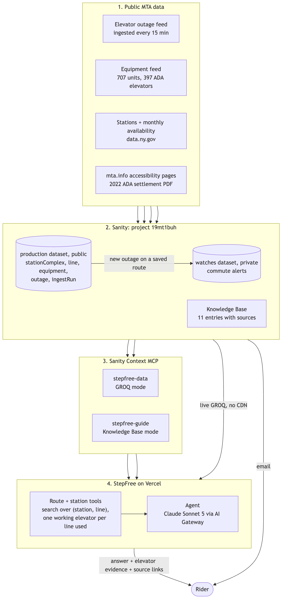

# StepFree

Step-free trips on the New York City subway, with the elevators each trip depends on.

Live: https://stepfree-alpha.vercel.app (no login). Sanity project `19mt1buh`, public dataset `production`, Studio at https://stepfree.sanity.studio.

StepFree is an agent over MTA elevator data in Sanity. Ask for a trip and it returns a candidate route that names the working ADA elevator it relies on at every boarding, transfer, and exit, checked against the live outage feed. It asks when a station name is ambiguous, answers accessibility policy questions from a Sanity Knowledge Base with source links, and can email a rider when an elevator on a saved route breaks.



## How a route is decided

- The search runs over (station complex, line) pairs using the MTA's "next accessible station" edges (`adaNeighbors`).
- Riding through a station never needs its elevators.
- Boarding, changing to, or leaving a line at a station is allowed only if a working ADA elevator there is listed for that line. An out elevator blocks the lines it serves. An out elevator with unknown lines blocks the whole station.
- Stations without full ADA status are never used to board, alight, or transfer.
- Outage data older than an hour, or with an unknown refresh time, is refused.
- Results are labeled candidate routes: the data does not describe passages between platforms inside a station.

Code: [web/src/lib/graph.ts](web/src/lib/graph.ts), station matching in [web/src/lib/data.ts](web/src/lib/data.ts), agent in [web/src/app/api/chat/route.ts](web/src/app/api/chat/route.ts).

## Layout

- `web/` Next.js app, agent, route and station tools
- `studio/` Sanity Studio and schema
- `ingest/` MTA feed loaders; `outages.ts` runs every 15 minutes in [.github/workflows/outages.yml](.github/workflows/outages.yml)
- `eval/` live evaluation cases and runner
- `docs/` architecture diagram, contest notes

## Run it

Requires Node (see `.node-version`) and pnpm.

```bash
pnpm install && pnpm --dir web install && pnpm --dir studio install
```

```bash
pnpm check
```

`pnpm check` runs typecheck, lint, and unit tests for all three packages.

Environment variables:

- Ingest and alerts (root `.env.local`, GitHub Actions secrets): `SANITY_PROJECT_ID`, `SANITY_DATASET`, `SANITY_WRITE_TOKEN`, `RESEND_API_KEY`, `STEPFREE_FROM`, `STEPFREE_SITE_URL`
- Web app (Vercel): `NEXT_PUBLIC_SANITY_PROJECT_ID`, `NEXT_PUBLIC_SANITY_DATASET`, `SANITY_CONTEXT_TOKEN`, `SANITY_WRITE_TOKEN` (private `watches` dataset), `RESEND_API_KEY`, `STEPFREE_FROM`, `STEPFREE_SITE_URL`
- Optional: `STEPFREE_MODEL`, `SANITY_CONTEXT_GROQ_ENDPOINT`, `SANITY_CONTEXT_KB_ENDPOINT`

The model runs through Vercel AI Gateway with OIDC, so no model provider key is needed.

```bash
npx tsx eval/run.mts
```

The eval sends every case in `eval/cases.json` to the live app, paced for its rate limit, and grades each answer with fixed checks. Results land in `eval/results/`.

## Data sources

- MTA elevator and escalator equipment and outage feeds (`api-endpoint.mta.info`)
- MTA subway stations and elevator availability datasets (data.ny.gov)
- mta.info accessibility pages and the 2022 ADA settlement agreement (CIDNY v. MTA), in the Knowledge Base

Not affiliated with the MTA. Always check mta.info/elevators before you travel.
