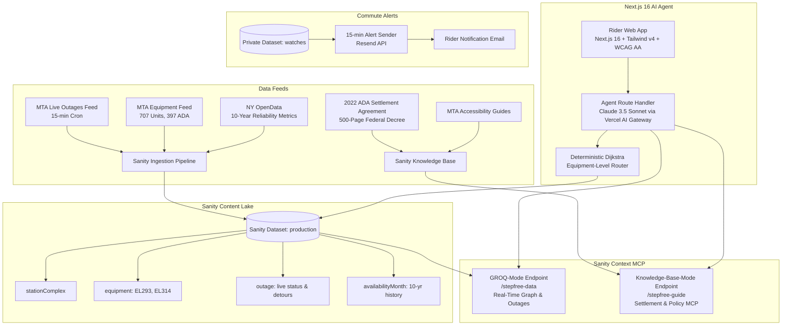

# StepFree: Why Transit Accessibility Demands Structured Content (And Why Plain RAG Fails)

*Entry for the DEV Sanity Challenge — Path One: Ship an Agent That Queries Real Content*
*Tag: #sanitychallenge*

---

## 🔗 Submission Links

- **Live Application**: [https://stepfree-alpha.vercel.app](https://stepfree-alpha.vercel.app) *(No login required, instant access)*
- **GitHub Repository**: [https://github.com/forbiddenlink/stepfree](https://github.com/forbiddenlink/stepfree)
- **Sanity Project ID**: `19mt1buh`
- **Public Sanity Dataset Query**: [https://19mt1buh.api.sanity.io/v2026-09-01/data/query/production?query=*[_type==%22stationComplex%22][0...3]](https://19mt1buh.api.sanity.io/v2026-09-01/data/query/production?query=*[_type==%22stationComplex%22][0...3])
- **Sanity Studio**: [https://stepfree.sanity.studio](https://stepfree.sanity.studio)

---

## 🚇 The Problem: New York's "Elevator Roulette"

For 1.4 million New Yorkers and millions of annual visitors who use wheelchairs, push strollers, travel with heavy luggage, or recover from injuries, navigating the New York City subway is not just about choosing a train—it is an exercise in high-stakes uncertainty.

Out of 472 subway stations, barely a third are ADA-accessible. Worse still, even when a station is officially designated "accessible," its elevators average over 25 unplanned breakdowns a year. If a wheelchair user boards a train at 14th Street and arrives at an unfamiliar station only to find the street elevator broken, they are trapped on the platform.

Mainstream navigation apps (Google Maps, Apple Maps, Citymapper) frequently fail these riders. Why?
1. **Station-level flags lie**: Marking a complex like *14 St–Union Sq* as "accessible" ignores that it has 6 different elevators. If elevator `EL314` is broken, the transfer from the L train to the 4/5/6 is impassable, even though street-to-platform elevators elsewhere in the complex still work.
2. **Generic LLM RAG fails completely**: A standard vector search over transit PDFs cannot compute graph reachability, cannot evaluate direction-specific platform dependencies, and cannot verify whether an outage at a through-station affects the rider or can be safely bypassed.

**StepFree** solves this by treating accessibility as an inspectable, graph-connected, real-time structured content system.

---

## 🏗️ Architecture & How It Works

StepFree pairs the **Sanity Content Lake** with **two distinct Sanity Context MCP endpoints**, a deterministic graph-routing engine, and real-time MTA elevator telemetry.

### Why Two Sanity Context Endpoints?

In Sanity Context, an endpoint configured with a dataset source operates in GROQ mode and does not index Knowledge Base sources. Conversely, Knowledge Base mode distills unstructured legal PDFs and websites into verifiable conceptual nodes.

StepFree explicitly separates these concerns into two specialized MCP endpoints:
1. **`stepfree-data` (GROQ Mode)**: Powers live graph adjacency, real-time elevator outages, physical equipment lookups, and 10-year monthly availability rankings.
2. **`stepfree-guide` (Knowledge Base Mode)**: Ingests the 2022 Federal ADA Settlement Agreement, capital construction commitments, Access-A-Ride policies, and reduced-fare rules.

---

## 🔍 Why Structured Content Was Strictly Necessary

The core prompt of the Sanity Challenge asks:
> *"The strongest submissions will show an agent that only works because the content was structured. If a keyword search would have gotten you the same answer, aim higher."*

Transit routing across broken infrastructure cannot be solved with keyword search. Consider what happens when a rider asks:
> *"Step-free from 1 Av to Times Sq right now?"*

To answer this reliably, the system must evaluate a 6-step relational chain:
1. **Resolve Origin & Destination**: Disambiguate station names (e.g. distinguishing the three separate "72 St" stations in NYC).
2. **Traverse Step-Free Adjacency**: Walk the `adaNeighbors` graph edges connecting accessible stations, computing the optimal path (1 Av $\to$ 14 St-Union Sq on the L, transfer to the N/Q/R/W to Times Sq-42 St).
3. **Inspect Station Accessibility**: Confirm both origin and destination have `adaStatus: "full"` platform access.
4. **Identify Physical Equipment**: Extract the exact required elevators along the path:
   - Origin: `EL292` / `EL293` (Street to L platform).
   - Transfer: `EL312` (L platform to mezzanine) $\to$ `EL314` (mezzanine to Uptown platform).
   - Destination: `EL101` / `EL102` (platform to street).
5. **Cross-Reference Temporal Outages**: Query live outages matching those exact equipment codes. Crucially, an elevator outage at *8 Av* or *3 Av* (stations the train passes through) must **not** invalidate the trip, because riding through a station does not require its elevators. But an outage on transfer elevator `EL314` **must** break the route.
6. **Surface Verifiable Evidence & Detours**: If an elevator is out, quote the official MTA `alternativeRoute` detour verbatim, calculate historical 12-month reliability, and cite the live feed timestamp.

None of this is possible with flat text or naive embeddings. It requires Sanity's TypeScript schemas, deterministic GROQ graph queries, and typed relational references.

---

## 🏆 Key Features & Usability

1. **Inspectable Physical Equipment Chain**:
   Every route result expands into an itemized elevator list showing equipment numbers (`EL293`), serving directions (`Street to Brooklyn-bound platform`), operating status, and 12-month uptime percentage.
2. **Smart Station Disambiguation**:
   Queries like `"72 St"` do not guess. StepFree detects ambiguity and renders interactive selection buttons with line bullets (`1/2/3`, `B/C`, `Q`) and borough tags.
3. **MTA Detour Alerts**:
   When an elevator is out, StepFree explains why the trip cannot be confirmed and quotes the exact MTA-prescribed bus/subway detour.
4. **WCAG 2.1 AA Compliant & Accessible Markdown**:
   High-contrast color tokens, full screen-reader announcements (`aria-live="polite"`), and an accessible Markdown renderer with clickable citations.
5. **Commute Watch & Private Dataset**:
   Riders can subscribe to automated alerts for their daily commute. If an elevator on their specific route breaks, they receive an email alert. Subscriber emails live in an isolated private Sanity dataset (`watches`), completely inaccessible to the public AI agent.

---

## 🧪 4 Judge Test Scenarios to Try

You can test these directly on the live app with one click:

| Scenario | Try Asking | What StepFree Proves |
| :--- | :--- | :--- |
| **1. Accessible Transfer** | *"Step-free from 1 Av to Times Sq right now?"* | Computes multi-leg journey, verifies transfer elevators at 14 St-Union Sq, displays equipment uptime. |
| **2. Single-Station Status** | *"Is the elevator at 161 St–Yankee Stadium working?"* | Returns a dedicated `ElevatorStatusCard` showing all elevators, uptime percentages, and live MTA feed time. |
| **3. Station Ambiguity** | *"Step-free from 72 St to Atlantic Av"* | Detects 3 separate 72 St stations and presents interactive selection options instead of hallucinating. |
| **4. Policy & Legal Deadline** | *"What does the 2022 ADA settlement promise, and by when?"* | Queries the Knowledge Base MCP, citing the 2055 systemwide deadline and 2045 95% milestone with clickable source documents. |

---

## 📊 Evaluation & Verification

- **42 Offline Unit Tests** (`vitest run`): 100% passing across graph traversal, feed validation, station disambiguation, watch token security, and markdown parsing.
- **Strict TypeScript & ESLint**: 0 errors, 0 warnings across root, web app, and Sanity Studio.
- **Fail-Closed Safety**: Ingestion rejects corrupted feed snapshots; routing refuses feeds older than 60 minutes.

---

## 💡 What We Learned & Limitations

- **What AI Got Wrong**: When given flat station lists, LLMs routinely hallucinated that any station with an elevator allowed step-free line transfers. Modeling physical equipment in Sanity as discrete `equipment` documents connected to `stationComplex` and `adaNeighbor` edges was the single change that eliminated route hallucinations.
- **Knowledge Base Discovery**: Two Context endpoints are necessary when combining quantitative operational data (GROQ) with qualitative legal texts (Knowledge Base).
- **Current Limitation**: StepFree relies on official MTA feeds. While feeds update approximately every 15 minutes, unannounced outages or immediate breakdowns can take 10–20 minutes to reflect in the feed. StepFree explicitly reports `sourceUpdatedAt` to ensure riders know the data's freshness.
